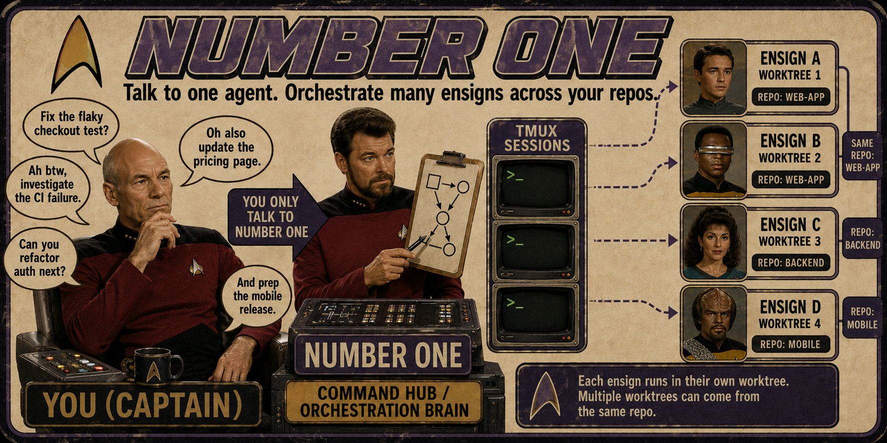

<h1 align="center">numberone</h1>
<p align="center">
  <a
    href="https://img.shields.io/badge/platform-macOS%20%7C%20Linux-blue?style=flat-square"
    ></a>
  <a href="https://x.com/kunchenguid"
    ></a>
  <a href="https://discord.gg/Wsy2NpnZDu"
    ></a>
</p>

<h3 align="center">Talk to one agent. Mission with a crew.</h3>

<p align="center">
  
</p>

## What it is

You can run one coding agent easily.
But the moment you want three project tasks done in parallel - fixes, investigations, plans, audits - you become a tab-juggler: babysitting sessions, copy-pasting context between repos, forgetting which terminal had the failing test.

numberone flips the model.
You talk to a single agent - the Number One - and it runs the crew for you: spawning autonomous agents in tmux windows, giving each a clean git worktree, supervising them to completion, and handing you finished PRs, approved local merges, or standalone investigation reports.
For larger fleets, you can opt in to persistent lieutenants: domain supervisors that are still ordinary direct reports, but run from their own isolated numberone homes.
There is no app to install; the orchestrator is `AGENTS.md`, bundled skills, and helper scripts that any terminal coding agent can follow.

This is not an agent harness. This is not a single skill. This is not a CLI.
This is.. a directory that turns any agent into your numberone, and you the captain.

## Features

- **One liaison** - you talk only to the Number One; it dispatches, supervises, escalates only real decisions, and reports plain outcomes.
- **A visible crew** - every ensign works in its own tmux window you can watch or type into; the Number One reconciles.
- **Disposable worktrees** - each task runs in a clean [treehouse](https://github.com/kunchenguid/treehouse) git worktree, so parallel work on one repo never collides.
- **Two task shapes** - mission tasks deliver a change; survey tasks investigate, plan, reproduce, or audit and leave a report.
- **Explicit project modes** - each project delivers via `no-mistakes`, `direct-PR`, or `local-only`, with an optional `+yolo` autonomy flag.
- **Optional lieutenants** - opt in to persistent domain supervisors that run from isolated numberone homes with their own `N1_HOME`, state, projects, and session lock, kept on the primary numberone version by guarded local fast-forwards.
- **Event-driven, zero-token supervision** - a bash watcher sleeps on the fleet and wakes the Number One only when something needs you.
- **Optional X mode** - opt in with one local `.env` token so numberone can answer your public `@myfirstmate` mentions, act on normal reversible mention requests through the same lifecycle as chat requests, acknowledge spawned work, and post one public-safe completion follow-up without changing non-X behavior; dry-run preview records would-be replies and dismissals locally before go-live.
- **Guarded by construction** - the Number One is read-only over your projects outside guarded clone refreshes, safe branch pruning, and approved `local-only` fast-forward merges; ensigns make every project change behind your merge approval.
- **Restart-proof** - all state lives on disk and in tmux; kill the session anytime and the next one reconciles and carries on.

Full detail on every feature lives in [docs/architecture.md](docs/architecture.md).

## Quick Start

**Requirements:** a verified agent harness (claude, codex, opencode, or pi), git with GitHub auth, and tmux for the crew windows.
The Number One detects and offers to install everything else.

```sh
gh auth login
git clone https://github.com/alcarnes/numberone
cd numberone && claude   # launch your harness here; AGENTS.md takes over
```

Then just talk:

```sh
> ahoy! look at my github project xyz, then fix the flaky login test and add dark mode

# numberone checks its toolchain (asking your consent before installing anything),
# clones the project under projects/, and spawns two ensigns in tmux windows
# n1-fix-login-k3 and n1-dark-mode-p7.
# Minutes later:

  PR ready for review, captain: https://github.com/you/xyz/pull/42
  (fix flaky login test - risk: low - CI green)

> alright merge it
```

Run it inside tmux for the best experience: launching your harness from inside tmux puts every ensign window in your own session, where you can watch the crew work in real time or type into any window to intervene.
Outside tmux, ensigns land in a detached `numberone` session you can attach to.

## How It Works

```
            you (the captain)
                  │  chat: requests, decisions, "merge it"
                  ▼
 ┌─────────────────────────────────────┐
 │ numberone            (this repo)    │
 │ reads projects/ + numberone routes  │
 │ writes guarded backlog/briefs/state │
 └──┬──────────────┬───────────────┬───┘
    │ tmux send-keys / status files │
    ▼              ▼               ▼
 ┌────────┐   ┌────────┐      ┌────────┐
 │n1-task1│   │n1-task2│  ... │n1-taskN│   tmux windows you can watch
 │ensign│   │ensign│      │ensign│   one autonomous agent each
 └───┬────┘   └───┬────┘      └───┬────┘
     ▼            ▼               ▼
  treehouse worktree or isolated lieutenant home
     │
     ├─ mission: project mode ► PR/local merge ► teardown
     │
     └─ survey: report at data/<id>/report.md ► relay findings ► teardown
```

You chat with the Number One.
It routes each request to a ensign in its own tmux window and git worktree, supervises the fleet with a zero-token event-driven watcher, and brings you finished PRs, approved local merges, or investigation reports.
Persistent lieutenant homes are linked numberone worktrees; startup syncs live ones and lieutenant launch syncs the target home to the primary default-branch commit without fetching from origin when it is safe.
When a routed request goes to a lieutenant, numberone marks it so the answer returns through status or a document pointer; direct typing into that lieutenant window stays conversational.
A presence-gated sub-supervisor (`/afk`) can self-handle routine events and batch only what matters while you step away.
An opt-in X mode can also use the watcher check path to answer your public `@myfirstmate` mentions and act on normal reversible mention requests from the current fleet state, with `FMX_DRY_RUN` available to test the poll -> compose -> would-post loop without publishing.
The relay routes only the owner's own mentions to that owner's numberone home; parent-thread context may still include other public accounts.
The token is standing authorization for those autonomous replies and eligible lifecycle actions; destructive, irreversible, or security-sensitive asks are flagged for trusted-channel confirmation instead of being executed from a public mention.
Requests that finish immediately get one public-safe outcome reply.
Requests that spawn longer-running work get an acknowledgement first, a task link in local state, and one completion follow-up within the relay's 24h window when that task lands, reports, or fails.
It preserves parent-tweet context for conversational replies and dismisses pure acknowledgments at the relay without posting.
Long replies stay text-only: the reply client splits them into bounded numbered threads when needed.
When numberone works on itself, spawn-time isolation checks and a primary-checkout tangle alarm keep the operating checkout on its default branch and stop a ensign that did not land in a separate worktree.

Full architecture - the supervision engine, worktree isolation, lieutenants, project modes, optional X mode, fleet sync, and self-update - is in [docs/architecture.md](docs/architecture.md).

## Built-in skills

Number One delivers these user-invocable built-in skills.
Claude uses the slash form shown here; codex uses the same names with `$`, such as `$afk`.

| Skill              | What it does                                                                                                                                  |
| ------------------ | -------------------------------------------------------------------------------------------------------------------------------------------- |
| `/afk`             | Enter away-mode supervision: the sub-supervisor self-handles routine wakes in bash and escalates only captain-relevant events as one batched digest, cutting supervision cost while you step away |
| `/updatenumberone` | Self-update the running numberone and its lieutenants to the latest from origin with fast-forward-only pulls, then re-read instructions and nudge lieutenants |

Agent-only reference skills live under `.agents/skills/` and are loaded by numberone at the trigger points named in [`AGENTS.md`](AGENTS.md).

## Documentation

- [docs/architecture.md](docs/architecture.md) - how the crew, supervision, worktrees, lieutenants, and project modes work.
- [docs/configuration.md](docs/configuration.md) - environment variables, `N1_HOME`, optional X mode, the files you set, and harness support.
- [docs/scripts.md](docs/scripts.md) - the `bin/` toolbelt reference.
- [`AGENTS.md`](AGENTS.md) - numberone's full operating manual for the orchestrator agent.
- [CONTRIBUTING.md](CONTRIBUTING.md) - how to contribute, including the dev/test commands.

## Contributing

Contributions are welcome - see [CONTRIBUTING.md](CONTRIBUTING.md) for the workflow, repo conventions, and how to run the tests.

## License

MIT - see [LICENSE](LICENSE).
